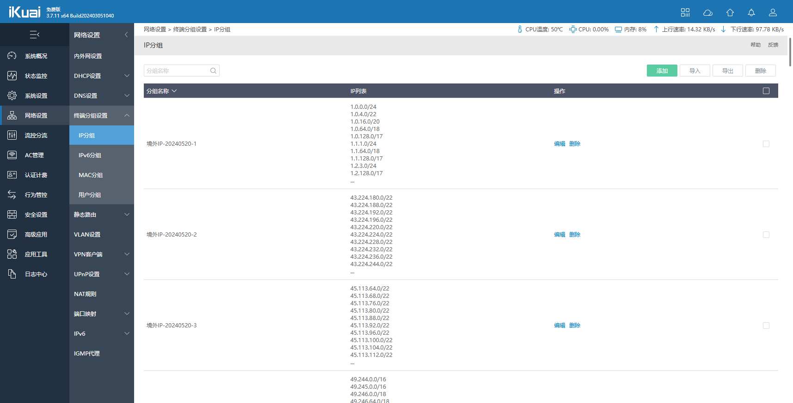
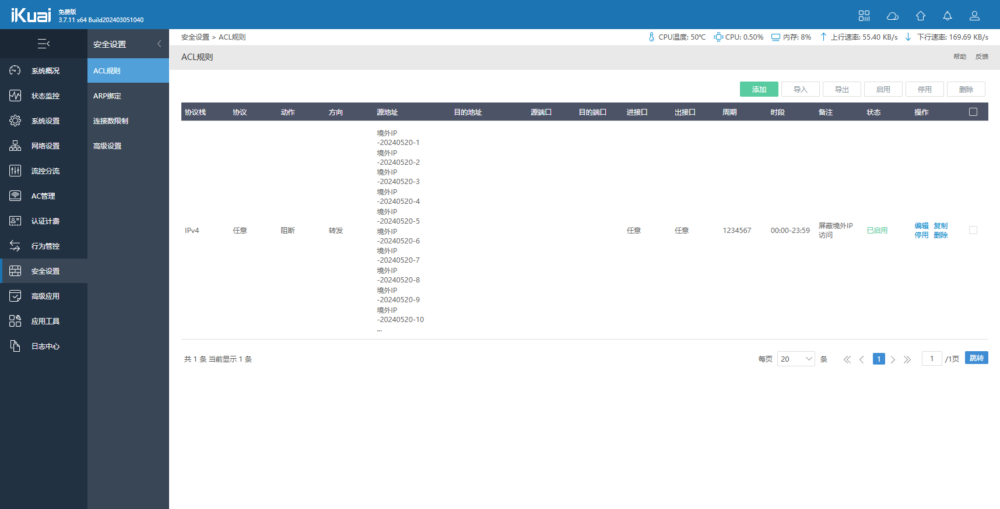

# 前言

如今网络安全问题愈发严峻，很多黑客甚至不是黑客的“入门新人”都开始全网地毯式扫描，并对扫出的端口与服务进行漏洞攻击、撞库和暴力破解，甚至改了非标端口也无法避免。这对于具备公网 IP 和向公网映射端口、服务的我们来说，无不是极大的挑战。

通过网络监控和行为审计，发现绝大多数扫描攻击行为都来自境外，于是便有了这个想法，可以想办法在软路由上屏蔽境外 IP 访问来一定程度的提高网络安全性。而爱快当前的版本并不支持“屏蔽境外 IP 访问”这么个功能，所以只能另辟蹊径，自己添加 IP 库并借由 ACL 规则来做屏蔽。

*需要注意，我这里提到的“屏蔽境外 IP 访问”仅是单向屏蔽来自境外 IP 的主动造访，并不影响我们主动访问境外网站和服务。*


# 适用情况

- 爱快免费版

- 具备公网 IPv4

- 向公网映射了 NAS 服务、WEB 服务、Windows 远程桌面、SSH 等。

- 不需要向境外用户提供直连的访问服务


# 操作方法

## 获取最新 IP 库并生成爱快格式的导入文件

执行命令：

```
bash get_overseas_cidr.sh
```

执行完成后，会得到 `overseas_ikuai_acl-20xxxxxx.txt`、`overseas_ikuai_ipgroup-20xxxxxx.txt` 两个文件。

你也可以直接下载我生成好的导入文件。


## 导入爱快

- 登录爱快面板
  
- 打开 `网络设置` - `终端分组设置` - `IP 分组`
  
- 点击右上角的【导入】，选择 `overseas_ikuai_ipgroup-20xxxxxx.txt` 文件，勾选“合并到当前数据”，确定导入。
  


- 打开 `安全设置` - `ACL 规则`
  
- 点击右上角的【导入】，选择 `overseas_ikuai_acl-20xxxxxx.txt` 文件，勾选“合并到当前数据”，确定导入。




# 缺陷

- 所采用的 IP 库虽然已非常完整全面，但仍不能精准覆盖所有境外 IP 网段，会有漏网之鱼。
  
- 若有 BT 或 PT 服务，将无法与境外用户共享数据。

- 由于爱快的每个 IP 分组最多只支持 1000 个 IP，故将导入几十个分组，删除时会稍显麻烦。
